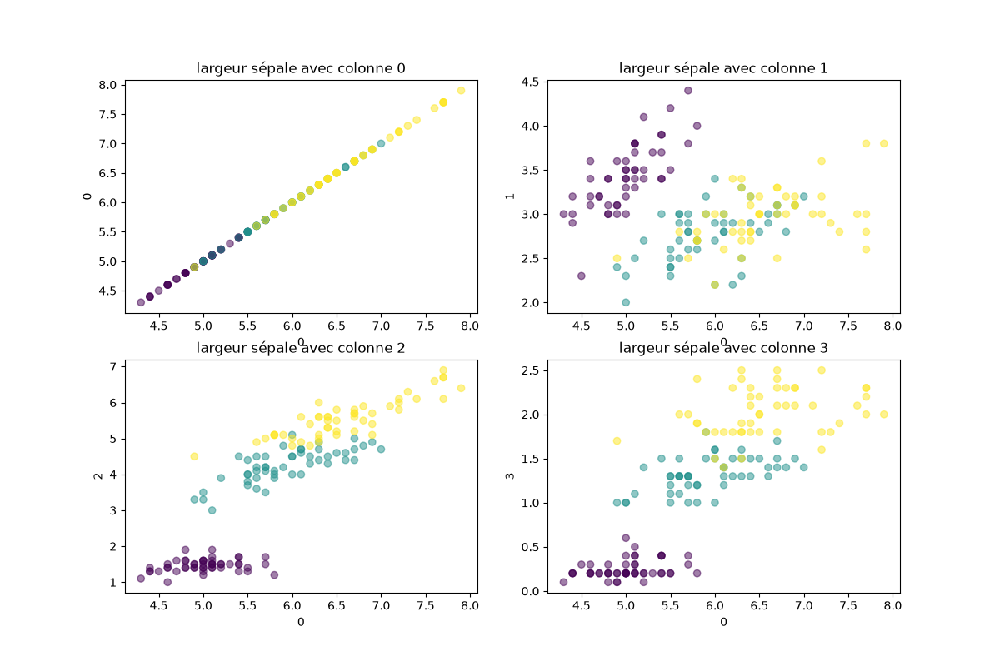

à partir du dataset des Iris créer la fonction generateFigure qui va créer le graphique suivant : 




```py
import matplotlib.pyplot as plt
from sklearn.datasets import load_iris
iris = load_iris() # le dataset

x = iris.data
y = iris.target # 0 1 2


def generateFigure(datasets , y):
    """ fonction à créer """

generateFigure(x , y)
```