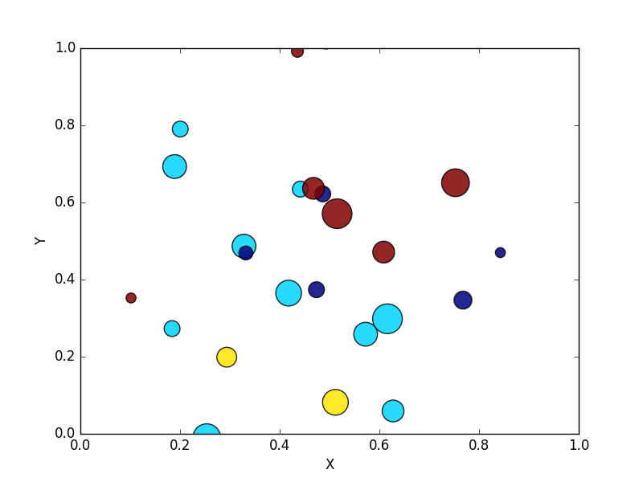

# Enoncé

Écrivez un programme Python qui dessine un nuage de points en utilisant des distributions aléatoires pour générer des points de différentes tailles.

voici une exemple de ce qui est attendu :

