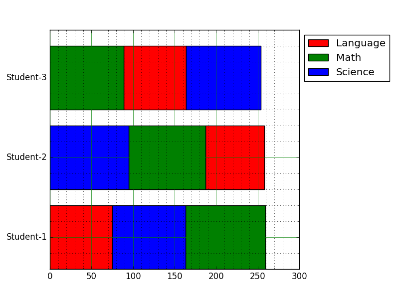

# dernier exo de la journée

Écrivez un programme Python qui crée un graphique à barres horizontales avec des couleurs ordonnées différemment.

languages = [
	['Language','Science','Math'],
	['Science','Math','Language'],
	['Math','Language','Science']
]

numbers = [
	{'Language':75, 'Science':88, 'Math':96},
	{'Language':71, 'Science':95, 'Math':92},
	{'Language':75, 'Science':90, 'Math':89}
]

prendre le graphique suivant :  comme résultat final de l'exo

