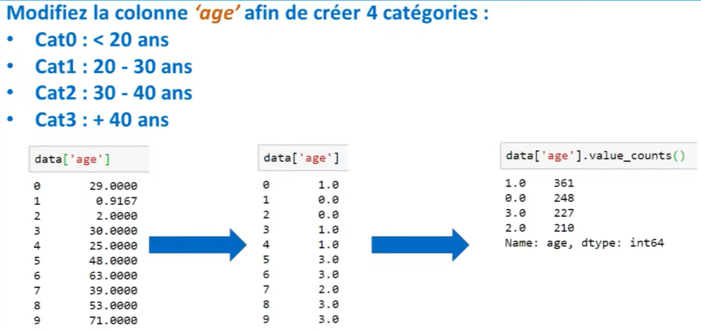

# créer des catégories

à partir du dataset titanic, vous devez utiliser la colonne Age est créer des catégories 

- entre 0 et 19 ans
- entre 20 et 29 ans
- entre 30 et 39 ans
- supérieur à 19 

l'objectif est de réaliser le value_count() suivant => voir l'impr écran 

